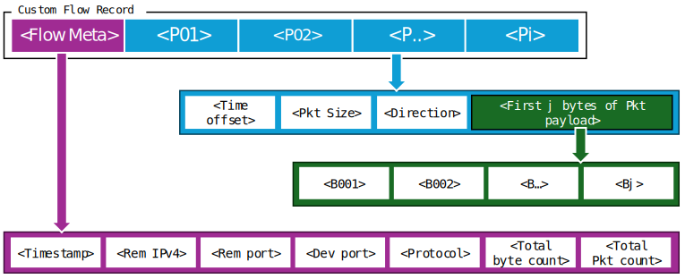

# Custom Flow

# Custom Flow – A Comprehensive Network Traffic Representation

## A. Overview

Analysing patterns in network traffic can be performed at both **micro** and **macro** levels.  
At the **micro level**, inspecting byte values within packet headers and payloads provides detailed behavioural insights but is often computationally expensive and limited in capturing broader communication context.  
At the **macro level**, flow-based aggregation offers a more scalable and cost-effective alternative. A *network flow* represents a sequence of packets sharing common properties such as source/destination IP addresses, source/destination port numbers, and protocol (e.g., TCP or UDP).  

While flow records are efficient for large-scale monitoring, they may lack the granularity needed for fine-grained classification of diverse devices and applications.  
To address this, we propose a **hybrid representation** that combines the strengths of both approaches—integrating flow metadata with selective packet-level information.

---

## B. Custom Bidirectional Flow Design

We introduce **custom bidirectional flows** to provide a comprehensive representation of network behaviours. Each custom flow aggregates metadata (key header fields), statistical summaries, packet timestamps and directions, and a subset of payload bytes from the first few packets in the flow.

A custom flow is uniquely identified by a **five-tuple**:  
*device IP address, remote IP address, protocol, device port, and remote port*,  
and has a **fixed lifetime of one minute**.

Long-running connections, such as persistent IoT–cloud sessions, are segmented into multiple consecutive flows to maintain computational efficiency and ensure consistent temporal granularity.  
When a flow exceeds one minute, a new flow record is created with the same five-tuple.

---

## C. Terminology and Direction Handling

To maintain generality, we replace the conventional *client* and *server* terminology with *device* and *remote*.  
This choice reflects the challenges of determining client–server roles in real time, particularly in **UDP** communications where connection states are ambiguous.  
Even in **TCP** flows, identifying session initiation and termination can be unreliable due to missing SYN/FIN packets.

For **device-to-device** communication within the monitored network, we generate **two mirrored flow records**, each reflecting the perspective of one device endpoint.  
Outgoing packets from one device correspond to incoming packets for the other, ensuring consistent bidirectional representation.  

For **device-to-cloud** traffic, only a single bidirectional flow is recorded and attributed to the local device.

---

## D. Flow Metadata and Generalisation

While TCP headers can exhibit device-specific characteristics [5], we intentionally exclude them to preserve **model generalisability**.  
Our design prioritises capturing discriminative information from the **transport-layer payload**, which often embeds unique **application-layer** behaviours revealing manufacturer signatures or functionality traits.

Each custom flow includes the following metadata:

- `timestamp` (µs): Unix timestamp of the first packet  
- `remote IPv4 address`  
- `protocol` (transport layer)  
- `device-side port` and `remote-side port`  
- total byte count and total packet count  

Local private IP ranges (`10.0.0.0/8`, `192.168.0.0/16`, `172.16.0.0/12`) of the remote endpoint are anonymised as `0.0.0.0`.  
To support portability across deployments, we exclude environment-specific identifiers such as MAC addresses and local IPs.

---

## E. Fine-Grained Packet-Level Features

To capture behavioural fingerprints within the flow, we include fine-grained information from the **first *i* packets** of each flow.  
The total number of packets and payload sizes can vary substantially, so analysing every packet is impractical.

Empirical studies [6] indicate that distinguishing features often appear in the **early bytes** of initial packets.  
Accordingly, for each of the first *i* packets, we record:

- time offset from the flow’s first-seen timestamp  
- total packet size  
- direction flag (1 = device → remote, 0 = remote → device)  
- up to *j* bytes of the transport-layer payload  

Parameters *i* and *j* are configurable based on system resources and network conditions.

In our dataset:
- **92%** of 1-minute flows contain **≤10 packets**, and  
- **96%** of packets are **≤1,000 bytes**.  

Therefore, we set *i = 10* and *j = 1,000*.

---

## F. Payload Considerations

We make **no assumptions** about payload contents—whether encrypted, encoded, or plaintext [7].  
Including payload bytes in custom flows enables learning models to discover both strong and weak behavioural patterns that characterise IoT device operations, even in encrypted traffic.

---

## G. Illustration of Custom Flow Structure

  
*Figure 1: Structure of custom flow records constructed from raw network traffic.*

---

## H. Dataset Description

The data was constructed by analyzing a public dataset of PCAP traces from [UNSW IoT Analytics](https://iotanalytics.unsw.edu.au/iottraces.html), collected by researchers at UNSW Sydney. It contains **60 days of traffic** from **22 consumer IoT device types**, including cameras, lightbulbs, power plugs, sensors, appliances, and health monitors.  
After processing, we extracted over **5.9 million custom flow records**.  

Table I summarises the number of flows per device type.  
The activity levels vary widely between devices—for instance, **Amazon Echo**, **Insteon camera**, and **Belkin motion sensor** generate significantly more flows than low-activity devices like **Withings scale**.

---

### Table I. Summary of Custom Flow Data

| **IoT Device Type**        | **# Custom Flows** |
|-----------------------------|--------------------|
| Amazon Echo                 | 777,587            |
| Belkin motion sensor        | 970,940            |
| Belkin power switch         | 642,451            |
| Dropcam                     | 171,929            |
| HP printer                  | 238,831            |
| iHome power plug            | 17,026             |
| Insteon camera              | 1,095,843          |
| LiFX lightbulb              | 190,632            |
| NEST Protect                | 989                |
| Netatmo camera              | 308,053            |
| Netatmo weather             | 76,972             |
| PIX-STAR photoframe         | 24,197             |
| Samsung camera              | 620,912            |
| Smart Things                | 195,540            |
| TP-Link camera              | 55,959             |
| TP-Link power plug          | 17,729             |
| Triby speaker               | 164,076            |
| Withings baby monitor       | 63,304             |
| Withings scale              | 805                |
| Withings sleep sensor       | 96,332             |
| IT (Android tablet)         | 235,311            |


### Parsing Parquet Data Files

To analyze the customFlow data in this repository, which is provided in Parquet format, follow these steps:

### Prerequisites

Ensure you have the necessary Python modules installed. Use `pip` to install them:

```bash
pip install pandas pyarrow
```

### Reading Parquet Files

Bidirectional and unidirectional customFlows are are located in the sub directories of flows/bidirectional and flows/unidirectional. To load and parse them in Python:

```python
import pandas as pd
import os

# Define the type of flow and the file name
flow_type = 'bidirectional'
file = '16-09-23.parquet'

# Load the Parquet file from the specified path
df = pd.read_parquet(os.path.join('./data/', flow_type, file), engine='pyarrow')

# Display the first few rows
print(df.head())
```

## Cite Our Data
[1] A. Sivanathan, D. Mishra, S. Ruj, N. Fernandes, Q. Z. Sheng, . Luo, D. Coscia, G. Batista and H. Habibi Gharakaheili, "Leveraging Neural Networks to Decode IoT Network Traffic Patterns and Sequence Dynamics", under review at IEEE Transcations on Netwrok and Service Management, Nov 2024.

## License

This project is licensed under the MIT License. See the [LICENSE](./LICENSE.md) file for details.
